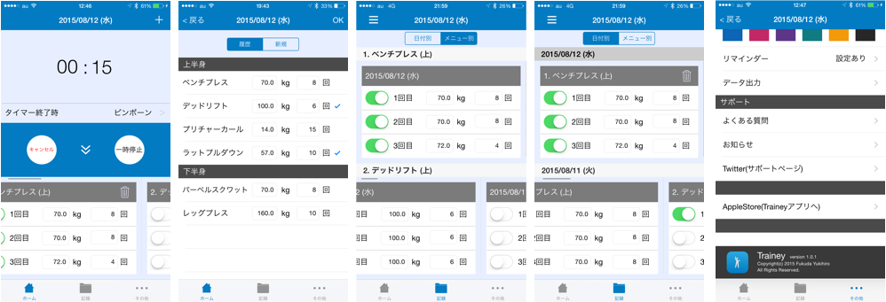

#  Trainey
・筋トレのiOS用の記録アプリです。

・[AppleStoreで無料でダウンロードできます。](https://geo.itunes.apple.com/jp/app/trainey-intabaru-zhongni-jian/id1022841669?mt=8)

## 特徴(ユーザーインターフェイス)
・インターバルの時間の間に筋トレの記録が付けやすい。

・画面遷移が少なく、ストレスフリー

・インターバルの時間を測定しながら筋トレの記録ができる。

## 概要 (ViewControllers)

# 

左から順に

* HomeViewController

`````
3セットまでの筋トレの記録ができ、横スクロール型で結果を確認できる。
`````

* HistoryMenuViewController

````
2回目の筋トレのメニューはここから追加できる。
````

* Menu_RecordViewController

````
メニュー別の筋トレの記録が確認できる。
````

* Date_RecordViewController

````
日付別の筋トレの記録が確認できる。
````

* SettingViewController

````
・UIの色を変えることができる。
・通知を登録できる。
````

となっている。

## データベース

・SQLite

## 参考

・[tableViewの中にtableViewを入れ子にする方法](http://qiita.com/bohemian916/items/16e647e9c493347bec1c)

・

## 参考図書

**データベース:**

・[iOS Core Data 徹底入門](http://www.amazon.co.jp/iOS-Core-Data徹底入門-國居-貴浩/dp/4798039799)

**その他:**

・[詳解 Objective-C 2.0 第3版](http://www.amazon.co.jp/詳解-Objective-C-2-0-第3版-荻原/dp/4797368276)