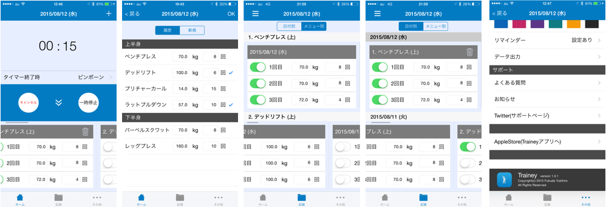

#  Trainey
・This is a iOSapp to record muscle training. 

・[you can download it at AppleStore in Japan.](https://geo.itunes.apple.com/jp/app/trainey-intabaru-zhongni-jian/id1022841669?mt=8)

## Feature(UserInterface)
・This app is easy to record muscle training at Interval Time.

・You can feel stress-free in using this app because screen transition is low.

・You can record muscle training while you measure the Interval Time.

## Overview (ViewControllers)

# 

From left...

* HomeViewController

`````
You can record three set's muscle traininig and see the result at side-scrolling tableView.
`````

* HistoryMenuViewController

````
When the second of muscle training, you can add a training menu from here.
````

* Menu_RecordViewController

````
You can check muscle training records which sorted by training menu 'Name'.
````

* Date_RecordViewController

````
You can check muscle training records which sorted by training menu 'Date'.
````

* SettingViewController

````
・You can change UI of this app's theme.
・You can register the notification which notice you training time.
````

end

## Database

・SQLite

## Reference

・[tableViewの中にtableViewを入れ子にする方法](http://qiita.com/bohemian916/items/16e647e9c493347bec1c)

・

## Reference Book

**Database:**

・[iOS Core Data 徹底入門](http://www.amazon.co.jp/iOS-Core-Data徹底入門-國居-貴浩/dp/4798039799)

**Other:**

・[詳解 Objective-C 2.0 第3版](http://www.amazon.co.jp/詳解-Objective-C-2-0-第3版-荻原/dp/4797368276)


